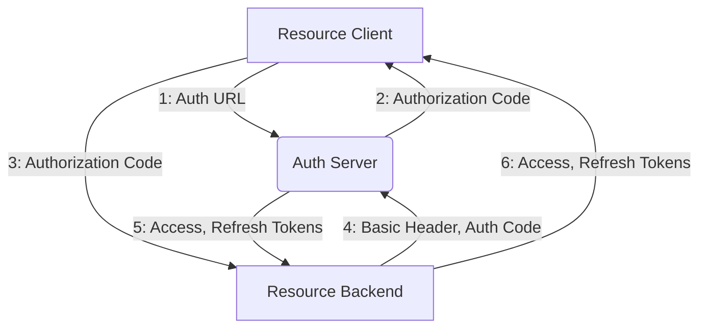

# Global OAuth2

Single sign-on authentication system built for in-house Staten Island Tech web apps.

## Installation and Registration

Clone the repository and install poetry.

```linux
pip install poetry
```

Install dependencies and set up server.

```linux
poetry install
```

```linux
python manage.py makemigrations
```

```linux
python manage.py migrate
```

Create a superuser.

```linux
python manage.py createsuperuser
```

Launch the server.

```linux
python manage.py runserver
```

Navigate to `http://127.0.0.1:8000/o/applications` to register your application.


> **Remember to save the client id in frontend .env and both client id and secret in backend .env. The client secret should NEVER go in the frontend.**

Your application is now registered.

## Implementation

### Flow



### Steps

1. Generate a redirect url using the following format. When the user logs in, they will be redirected to the redirect uri

```linux
http://localhost:8000/o/authorize/?response_type=code&client_id={{ CLIENT_ID }}&redirect_uri={{ REDIRECT_URI }}
```

> **The redirect uri must be the one you defined when you registered the application.**

2. Authorization code will be sent back to the redirect uri with url query key: `code`.

3. Send authorization code to backend for use in token post request.

4. Now you will retrieve the access and refresh tokens. First, generate a Basic header. To do this, base64 encode a string in this format, and attach it as a header and construct the body to the post request as shown.

```js
stringToBeEncoded = `${client_id}:${client_secret}`; // javascript syntax

... headers: {
  "Authorization": `Basic ${base64Encode(stringToBeEncoded)}`
}
... body: {
  "grant_type": "authorization_code",
  "code": AuthorizationCode, // sent from the frontend
  "redirect_uri": RedirectURI // as defined in your application
}

// POST TO:
'http://127.0.0.1:8000/o/token/'
```

5. Access and refresh tokens returned from the post request to `http://127.0.0.1:8000/o/token/`. Sample response:


6. Tokens sent to frontend.

You are now signed in and can query user data.
